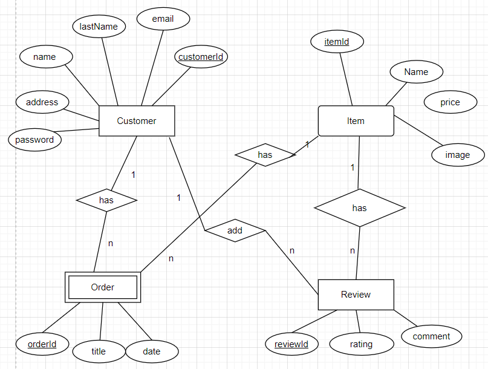
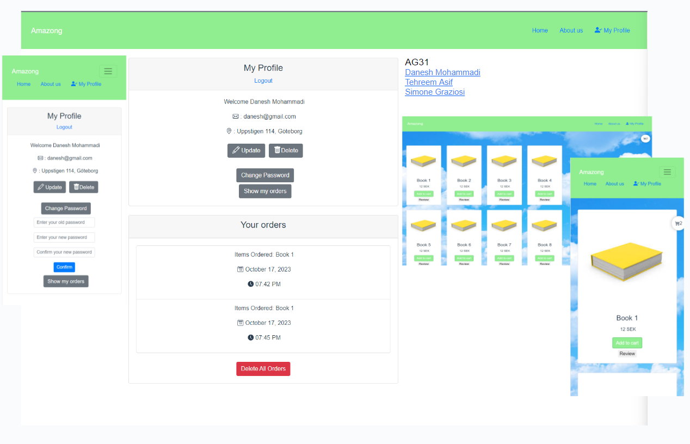

## Getting started

```bash
# Clone repository
git clone git@git.chalmers.se:courses/dit342/group-00-web.git

# Change into the directory
cd group-00-web

# Setup backend
cd server && npm install
npm run dev

# Setup frontend
cd client && npm install
npm run serve
```

## System Definition (MS0)

### Purpose

Our e-commerce website provides an easy to use and user-focused platform for online shopping. Users can create accounts, manage their carts, look for products, and place orders on this platform. 

### Pages

* Home: the Home page welcomes users to the site, showcasing the available products. The navigation bar aids easy access to different sections like items, About, and Login. The cart icon indicates a shopping cart to hold chosen items..
* Shopping cart: the Shopping Cart page allows customers to view, add, or remove items. Each listed item shows a thumbnail image, name, and price. A total price, calculated at the bottom, gives a quick overview of the total cost. Users can proceed to order their selected items from this page.
* Login/signup: the Login page provides an interface for customers to log in or sign up for an account. The signup section collects necessary information such as email, password, name, and last name, ensuring all fields are filled before submission. On successful account creation or login, customers are navigated to their profile page. In case of any input error or signup/login failure, an error message is displayed to guide the user.
* About: the About page provides comprehensive information about the website, aiding users to understand the site's purpose, offerings, and how to navigate through different sections.
* My Profile: Once logged in, users are navigated to the My Profile page, a personal dashboard that allows them to view and edit their information, change their password, review their order history, and even delete their account if desired. This page displays the user's saved email and address, ensuring easy updates whenever necessary. Additionally, a 'Log Out' button is available for users wishing to log out. 
 

### Entity-Relationship (ER) Diagram



## Teaser (MS3)


